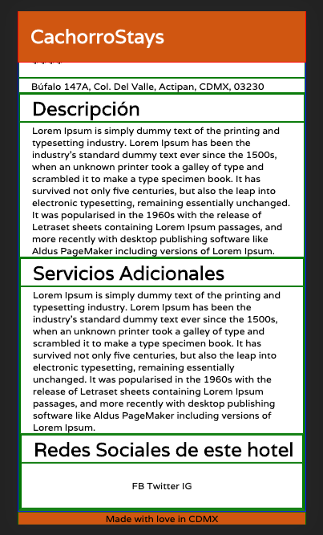

# cachorroStays

This is the repo for the team, The Callback Boys' Platzi Escuela de JS project.

# hotels_details_pg

This branch is meant for the basic skeleton for the hotels details pg.

Once the user selects a dog hotel to view further, they will arrive to this structure of a page.

[]
